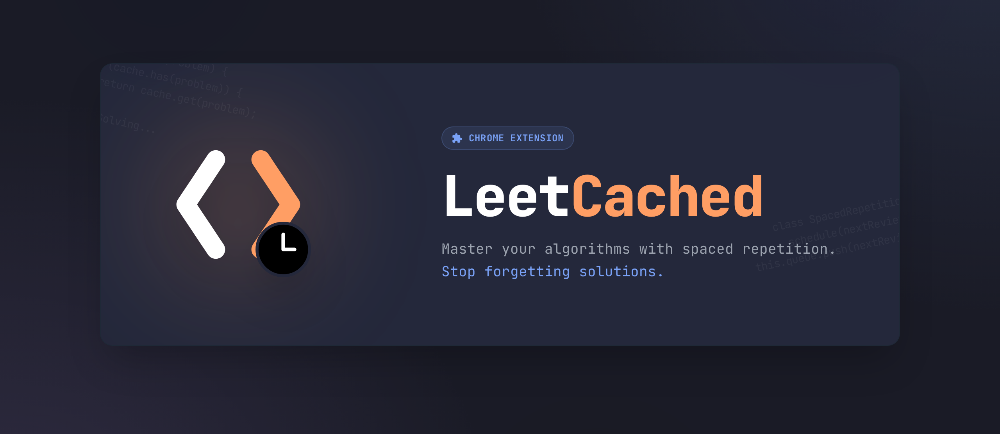
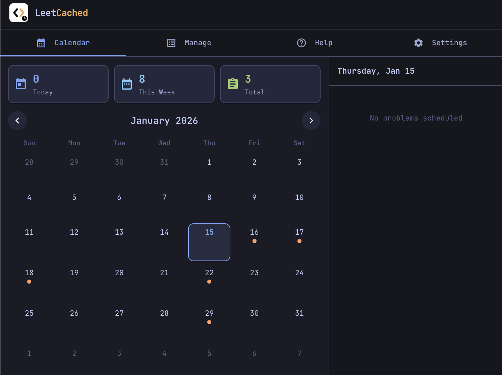
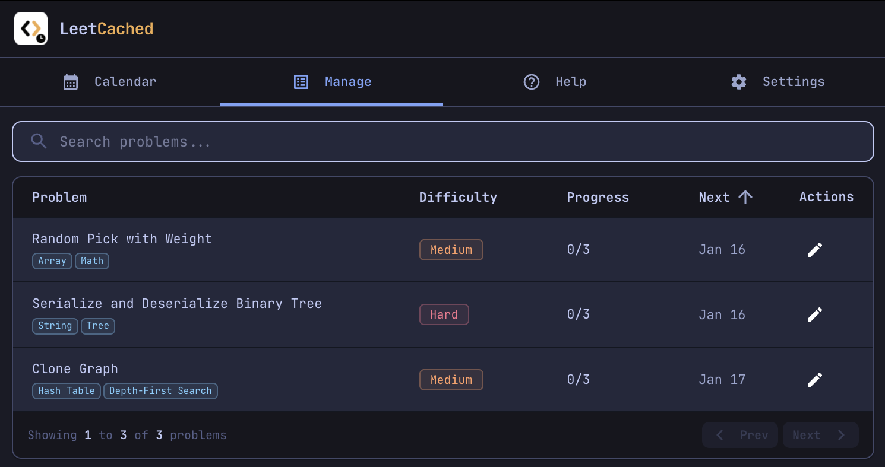
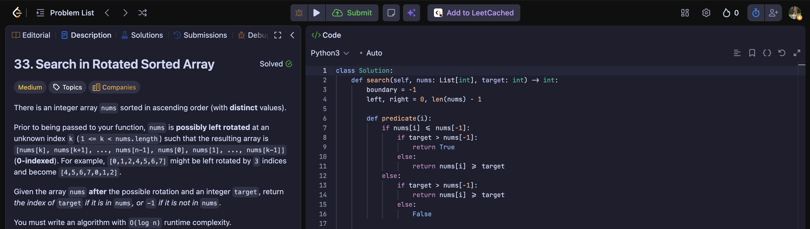
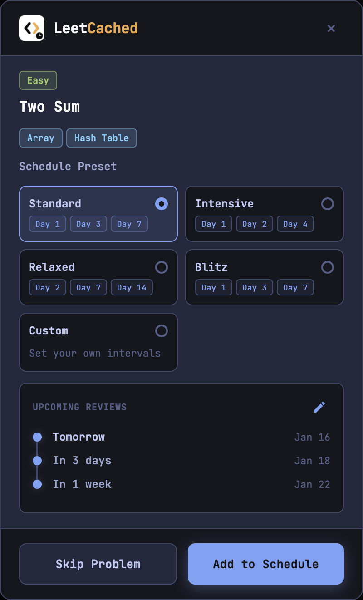
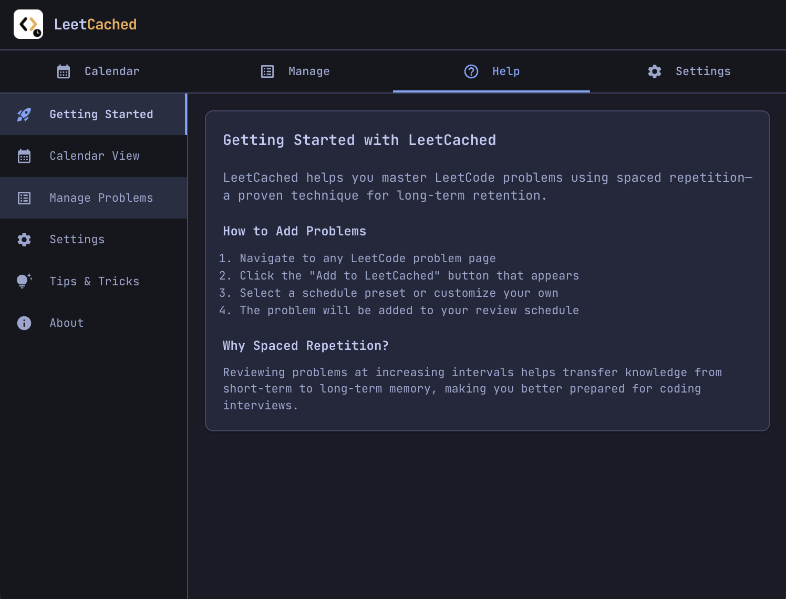
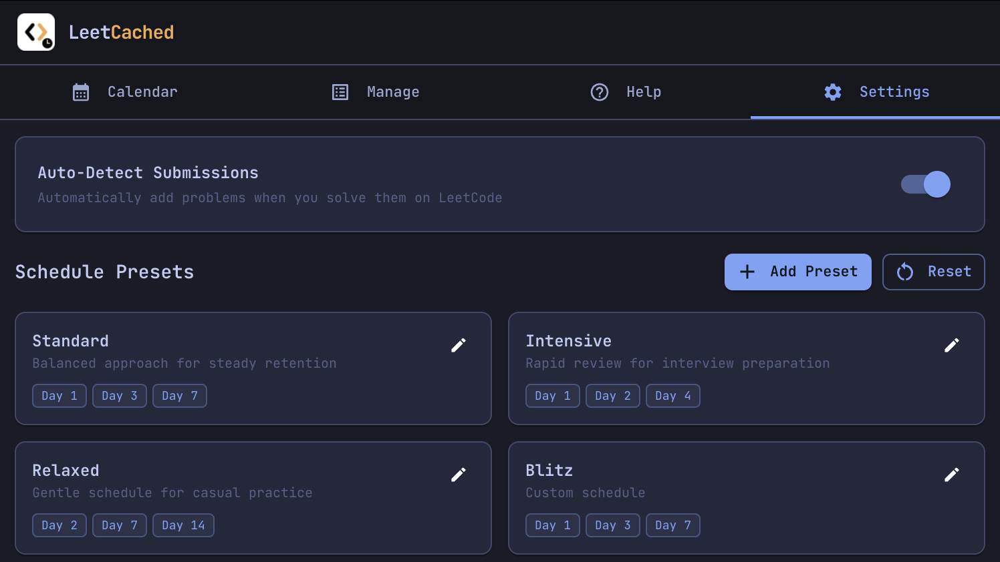

# LeetCached

A Chrome extension that helps you retain LeetCode solutions through spaced repetition scheduling. Built with **Material Design** components and a beautiful **Tokyo Night** color theme.



## ✨ Features

- **🎨 Material Design + Tokyo Night**: Sleek Material UI components styled with the popular Tokyo Night color palette
- **🔍 Automatic Detection**: Detects when you successfully submit a LeetCode problem and prompts to add it to your schedule
- **➕ Toolbar Button**: "Add to LeetCached" button in LeetCode's toolbar lets you add any problem anytime
- **📅 Spaced Repetition Scheduling**: Automatically schedules review dates using proven intervals (1, 3, 7, 14, 30 days)
- **🗓️ Calendar View**: Visual calendar showing upcoming problems to review with inline problem sidebar
- **📋 Problem Management**: Edit, reschedule, or remove problems from your review list
- **⚙️ Custom Intervals**: Choose from preset schedules (Standard, Intensive, Relaxed) or set custom intervals

## 🚀 Installation

### From Chrome Web Store
[](https://chromewebstore.google.com/detail/leetcached/blkpkeambbkiljehnlmclemjegnmhakm)

### Manual Installation (Developer Mode)
1. Clone or download this repository
2. Open Chrome and navigate to `chrome://extensions/`
3. Enable "Developer mode" in the top right corner
4. Click "Load unpacked" and select the extension folder
5. The LeetCached icon will appear in your toolbar

## 📖 Usage

1. **Install & Pin** - Pin LeetCached to your toolbar for easy access
2. **Add Problems** - Problems are auto-detected when accepted, or click "Add to LeetCached" in the LeetCode toolbar anytime
3. **Choose Schedule** - Select a preset interval (Standard, Intensive, Relaxed) or configure custom review dates
4. **Review Problems** - Click the extension icon to see your calendar and upcoming reviews
5. **Stay on Track** - Check the stats cards to see problems due today and this week

## 📸 Screenshots

### Calendar View


*Visual calendar with scheduled problems and sidebar showing daily reviews*

### Manage View


*Search, sort, and manage all your tracked problems*

### Add to LeetCached Button


*One-click button in LeetCode's toolbar to add any problem*

### Add Problem Modal


*Choose your spaced repetition schedule when adding problems*

### Help & Support


*Built-in help center with getting started guide and FAQs*

### Settings View


*Customize your spaced repetition presets with editable intervals*

## 🎨 Tokyo Night Theme

LeetCached features a carefully crafted dark theme using the Tokyo Night color palette:

| Element | Color | Hex |
|---------|-------|-----|
| Background | Dark Blue | `#1a1b26` |
| Surface | Slate | `#24283b` |
| Primary | Blue | `#7aa2f7` |
| Secondary | Purple | `#bb9af7` |
| Success | Green | `#9ece6a` |
| Warning | Orange | `#ff9e64` |
| Text | Light Blue | `#c0caf5` |

## 📚 How Spaced Repetition Works

Spaced repetition is a learning technique that involves reviewing material at increasing intervals:

### Preset Schedules

| Preset | Intervals (days) | Best For |
|--------|------------------|----------|
| **Standard** | 1, 3, 7, 14, 30 | Balanced retention |
| **Intensive** | 1, 2, 4, 7, 14 | Quick mastery |
| **Relaxed** | 2, 7, 14, 30, 60 | Long-term retention |

This pattern helps transfer knowledge from short-term to long-term memory, making it ideal for retaining coding patterns and problem-solving techniques.

## 🔒 Privacy

LeetCached respects your privacy:
- All data is stored **locally** on your device using Chrome's storage API
- **No data is sent** to external servers
- **No tracking** or analytics
- **No account required**

## 🔐 Permissions

| Permission | Purpose |
|------------|---------|
| `storage` | Store your tracked problems and review schedule locally |
| `host_permissions` (leetcode.com) | Detect accepted submissions and inject toolbar button |

## 🛠️ Development

### Project Structure
```
LeetCached/
├── manifest.json              # Extension configuration (Manifest V3)
├── content/                   # Content script (injected into LeetCode)
│   ├── src/
│   │   ├── index.jsx          # React entry point
│   │   ├── AddButton.jsx      # "Add to LeetCached" toolbar button
│   │   ├── AddProblemModal.jsx # Modal for adding problems
│   │   ├── styles.css         # Content script styles
│   │   └── utils/
│   │       ├── problemInfo.js      # Extract problem metadata
│   │       ├── storage.js          # Chrome storage utilities
│   │       └── submissionDetection.js # Auto-detect accepted submissions
│   ├── dist/                  # Built content script output
│   ├── package.json
│   └── vite.config.js
├── popup/                     # Extension popup UI
│   ├── src/
│   │   ├── main.jsx           # React entry point
│   │   ├── App.jsx            # Main app component with routing
│   │   ├── theme.js           # MUI Tokyo Night theme configuration
│   │   ├── components/
│   │   │   ├── CalendarView.jsx   # Calendar with scheduled problems
│   │   │   ├── ManageView.jsx     # Problem list management
│   │   │   ├── SettingsView.jsx   # Custom preset configuration
│   │   │   ├── HelpView.jsx       # Help & FAQ section
│   │   │   ├── Header.jsx         # App header with stats
│   │   │   └── NavTabs.jsx        # Navigation tabs
│   │   ├── hooks/
│   │   │   ├── useProblems.js     # Problem state management
│   │   │   └── useSettings.js     # Settings state management
│   │   └── styles/
│   │       └── index.css          # Global styles
│   ├── dist/                  # Built popup output
│   ├── index.html
│   ├── package.json
│   └── vite.config.js
├── icons/                     # Extension icons
│   ├── icon16.png
│   ├── icon48.png
│   └── icon128.png
└── screenshots/               # README screenshots
```

### Building

The extension uses Vite to build both the popup and content scripts:

```bash
# Install dependencies
cd popup && npm install
cd ../content && npm install

# Build for production
cd popup && npm run build
cd ../content && npm run build

# Development mode (watch for changes)
cd popup && npm run dev      # Starts dev server for popup
cd content && npm run dev    # Watches and rebuilds content script
```

### Tech Stack
- **React 18** - UI components and state management
- **Vite** - Fast build tool and dev server
- **Material UI (MUI) v5** - Component library with custom theming
- **Emotion** - CSS-in-JS styling solution
- **Chrome Extensions Manifest V3** - Modern extension architecture
- **Tokyo Night Theme** - Custom MUI theme with Tokyo Night colors

## 🤝 Contributing

Contributions are welcome! Feel free to open issues or submit pull requests.

## 📄 License

MIT License - feel free to use and modify as needed.

---

<p align="center">
  Made with 💜 for the LeetCode community
</p>
